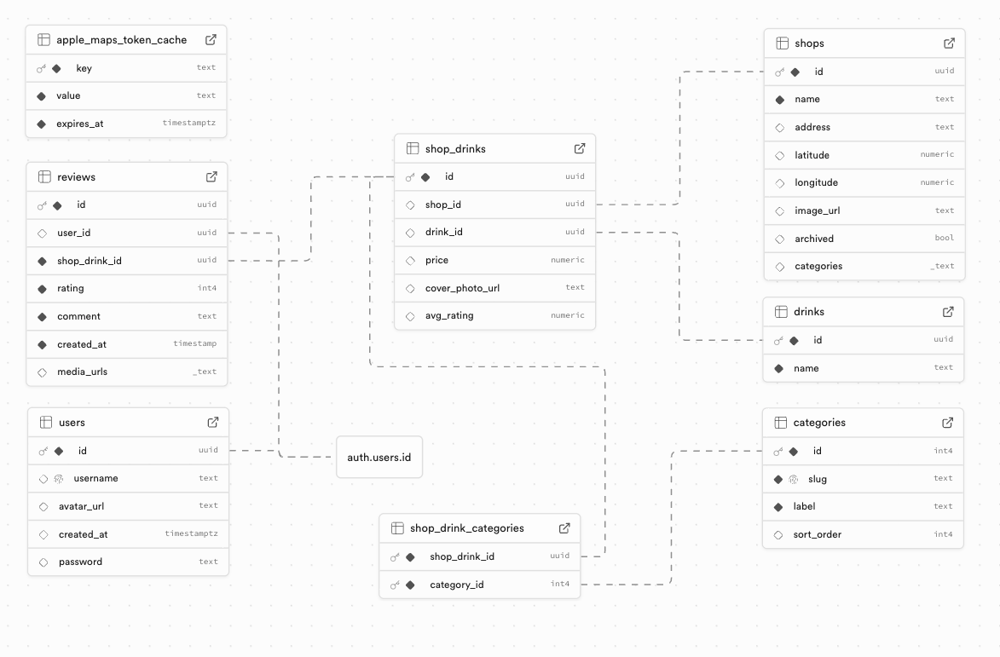

# Cup Trail
Cup Trail is a cross-platform app for discovering and tracking drinks at cafés.
It’s built around the idea that drinks — not just shops — are the true unit of discovery.

Instead of treating reviews as “a shop rating,” the system models a review as “a specific drink at a specific shop,” so the app can answer:

- What should I order here?
- What do I personally like at this shop?
- What drinks are trending at this location?
- Which cafés can I go to for this specific drink?

## Product Pillars

### Discover - “What should I try here?”
Discovery built around real ordering behavior, not generic shop ratings.

Cup Trail aggregates reviews at the drink + shop level so users can see what people actually order — and enjoy — at a specific café.

Today
- Browse cafés through the drinks people review, not just shop scores
- Surface popular and well-rated drinks at a specific shop
- Discover new spots based on what customers actually order and rate

Planned
- Smarter discovery using drink categories and flavor types
- Trend signals (e.g. what’s popular right now vs. historically)
- Location-aware recommendations that factor in city and nearby preferences
  
### Log - “What do I actually like here?”
A personal drink history, surfaced in a way that’s actually useful.

Instead of a flat list of reviews, Cup Trail treats each review as a data point that can be summarized back to the user over time.

Today
- Log drinks you’ve tried with ratings and photos
- Build a visual record of café visits and drinks over time
- See which drinks you personally liked most at a given shop, based on your past reviews

Planned
- Richer tasting notes and structured attributes
- Intelligent summaries of personal preferences (e.g. favorite drink types)
- Better “what should I order again?” signals when returning to a café

## Tech Stack

- Web (mobile-friendly): React + Vite
- Mobile (temporarily paused): React Native (Expo) 
- Backend: Supabase (PostgreSQL, Auth, Storage, Edge Functions)
- APIs: Apple Maps Server API
- Shared: TypeScript monorepo (pnpm workspaces)

## Project Structure

```
cup-trail/
├─ apps/
│  ├─ web/                           # React + Vite web app (mobile-friendly)
│  │  ├─ src/
│  │  │  ├─ components/              # web-only UI components (Tailwind, etc.)
│  │  │  ├─ queries/                 # cached queries
│  │  │  └─ App.tsx                  # router entry / layout
│  │  ├─ public/                     # favicons, static assets
│  │  ├─ vite.config.ts
│  │  └─ tsconfig.json
│  └─ mobile/                        # Expo (React Native) app (paused)
│     ├─ app/                        # expo-router routes
│     ├─ components/                 # mobile-only UI components
│     └─ …
├─ packages/
│  ├─ core/                          # Shared business/data layer (queries + domain logic)
│  └─ utils/                         # Shared utilities (supabase client, maps helpers, env)
├─ supabase/
│  └─ functions/                     # Edge Functions (Apple Maps proxy, etc.)
├─ pnpm-workspace.yaml
├─ tsconfig.base.json
├─ eslint.config.js
└─ package.json
```
## Backend + Data Model Design Decisions



1) Model “ShopDrink” as the core entity (join table)

Decision: represent “a drink at a shop” as its own record (often called shop_drinks).
Why: reviews belong to the pairing — not just the shop or drink alone.
Enables:
- “Popular drinks at this shop”
- “My favorite drinks at this shop”
- “Avg rating for this drink at this shop”
- clean deduping (many users reviewing the same menu item at the same place)

Mental model:
- shops = places
- drinks = drink definitions (matcha latte, hojicha, etc.)
- shop_drinks = menu items (drink X is served at shop Y)
- reviews = user feedback on a shop_drink

2) Reviews are first-class and link to shop_drinks

Decision: a review references a shop_drinks row (not just shop_id).
Why: it keeps review data precise and makes aggregation easy.
Enables:
- reliable averages by menu item
- per-user personalization on the same menu item
- future features like “most reviewed drink at this shop” or “trending this week”

3) Separate “discovery metadata” from “review content”

Decision: keep the stable entities (shops/drinks/menu pairing) separate from user-generated review content (rating/comment/photos).
Why: menu items are shared across users; reviews are per-user and time-based.
Enables:
- stable lists + caching
- time-based trends
- moderation / privacy rules per review later without touching shop data

4) External map provider is isolated behind a proxy layer

Decision: use an Edge Function (proxy) for Maps autocomplete/details/geocode.
Why: keys/tokens stay server-side, and the client only talks to your API.
Enables:
- better security (no provider secrets in client)
- consistent response format across platforms
- caching tokens centrally (less rate limit pain)
- CORS control for local + deployed apps

## 🛠️ Setup Instructions

1. **Clone the repo**

```
git clone https://github.com/Cup-Trail/cup-trail.git
cd cup-trail
```

2. **Install dependencies**

Prerequisites:

- Node 20.19+ (or newer)
- pnpm 10+
- Supabase project (URL + anon key)

```
pnpm install
```

3. **Set up environment variables**
   Create a .env file in the each respective app:

apps/mobile/.env

```
EXPO_PUBLIC_SUPABASE_URL=your-supabase-url
EXPO_PUBLIC_SUPABASE_PUBLISHABLE_KEY=your-supabase-publishable-key
```

apps/web/.env

```
VITE_SUPABASE_URL=your-supabase-url
VITE_SUPABASE_PUBLISHABLE_KEY=your-supabase-publishable-key
```

4. **Run the app**

- mobile: `pnpm run dev:mobile`
- web: `pnpm run dev:web`

5. **Run linter**
   From repo root:

- Lint all: `pnpm lint`
- Fix lint: `pnpm lint:fix`
- Typecheck: `pnpm typecheck`

## Meet the Team

This project wouldn't have been possible without the creativity, technical skill, and thoughtful feedback of the following team members:

[Katherine Wong] – Full-stack Developer

[John Adams] – Full-stack Developer

[Ly Nguyen] – Frontend Developer, Advisor

[Tracy Nguyen] – UI/UX Designer, Advisor
